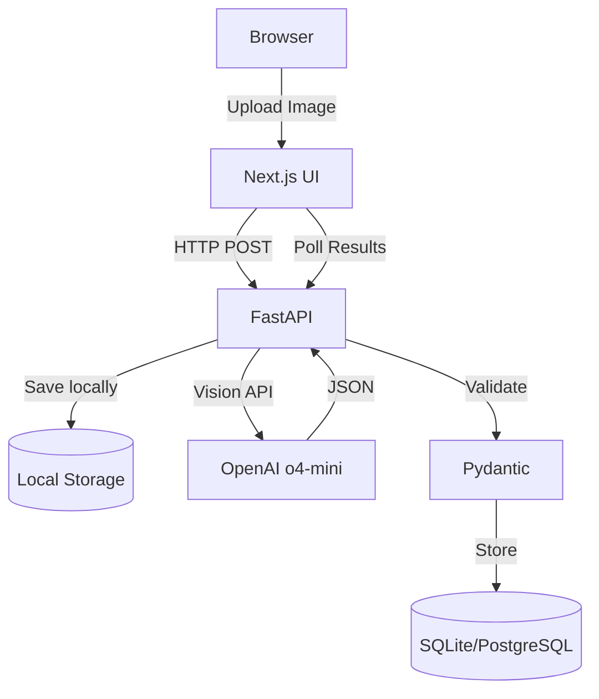

# Maritime Field Document Extraction App - Build Instructions

**For internal use, small-scale deployment (~100 documents/month)**

## Overview
A simple web application that extracts structured data from maritime field documents (images only) using OpenAI Vision API, with local file storage and Docker deployment.

## Architecture (Simplified)



## Project Structure

```
maritime-doc-extractor/
├── frontend/              # Next.js 14 app
│   ├── Dockerfile
│   └── ...
├── backend/              # FastAPI service
│   ├── Dockerfile
│   ├── main.py
│   ├── models.py        # Pydantic models from schema
│   ├── vision.py        # OpenAI Vision integration
│   └── ...
├── uploads/             # Local image storage
├── data/                # SQLite DB location (if using)
├── schema/
│   └── field_doc_schema.json
├── docker-compose.yml
├── .env.example
└── README.md
```

## 1. Backend Implementation

### `backend/main.py`

```python
from fastapi import FastAPI, UploadFile, File, HTTPException
from fastapi.responses import JSONResponse
from pathlib import Path
import uuid
import json
from datetime import datetime
from typing import Optional
from .models import FieldDocument
from .vision import extract_document_data

app = FastAPI(title="Maritime Document Extractor")

UPLOAD_DIR = Path("/app/uploads")
UPLOAD_DIR.mkdir(exist_ok=True)

@app.post("/api/upload")
async def upload_document(file: UploadFile = File(...)):
    """Accept image upload and process synchronously"""
    
    # Validate file type
    if not file.content_type.startswith('image/'):
        raise HTTPException(400, "Only image files are accepted")
    
    # Save file locally
    file_id = str(uuid.uuid4())
    file_ext = Path(file.filename).suffix
    file_path = UPLOAD_DIR / f"{file_id}{file_ext}"
    
    with open(file_path, "wb") as f:
        content = await file.read()
        f.write(content)
    
    try:
        # Extract data using OpenAI Vision (synchronous)
        extracted_data = await extract_document_data(file_path)
        
        # Store result (simple JSON file for now)
        result_path = UPLOAD_DIR / f"{file_id}_result.json"
        with open(result_path, "w") as f:
            json.dump({
                "id": file_id,
                "filename": file.filename,
                "processed_at": datetime.utcnow().isoformat(),
                "data": extracted_data.dict()
            }, f, indent=2)
        
        return {
            "id": file_id,
            "status": "completed",
            "data": extracted_data.dict()
        }
        
    except Exception as e:
        return {
            "id": file_id,
            "status": "error",
            "error": str(e)
        }

@app.get("/api/result/{file_id}")
async def get_result(file_id: str):
    """Retrieve processed result"""
    result_path = UPLOAD_DIR / f"{file_id}_result.json"
    
    if not result_path.exists():
        raise HTTPException(404, "Result not found")
    
    with open(result_path) as f:
        return json.load(f)

@app.get("/health")
async def health_check():
    return {"status": "healthy"}
```

### `backend/vision.py`

```python
import openai
import json
import base64
from pathlib import Path
from .models import FieldDocument
from pydantic import ValidationError
import os

client = openai.OpenAI(api_key=os.getenv("OPENAI_API_KEY"))

async def extract_document_data(image_path: Path, max_retries: int = 3) -> FieldDocument:
    """Extract structured data from maritime field document using OpenAI Vision"""
    
    # Load your specific schema
    with open("schema/field_doc_schema.json") as f:
        schema = json.load(f)
    
    # IMPORTANT: Set additionalProperties to false for strict validation
    schema["additionalProperties"] = False
    
    # Encode image
    with open(image_path, "rb") as f:
        image_base64 = base64.b64encode(f.read()).decode('utf-8')
    
    # Detailed prompt based on your expected output structure
    system_prompt = """You are a specialized maritime cargo document parser. Extract ALL values from the field document image exactly as shown.

CRITICAL EXTRACTION RULES:
1. Tank IDs must match exactly (e.g., "1P", "1S", "2P", etc.)
2. Convert all dates/times to ISO-8601 format (e.g., "2025-05-21T06:15:00")
3. Extract ALL tank rows from both arrival and departure sections
4. Calculate summary totals by product type (IFO 380, MGO, etc.)
5. Products loaded/discharged = Arrival values - Departure values
6. Preserve exact decimal precision for all measurements
7. Water specific gravity is typically 1.025 for salt water, 1.000 for fresh water
8. Draft readings are in feet with one decimal place"""
    
    messages = [
        {"role": "system", "content": system_prompt},
        {"role": "user", "content": [
            {"type": "text", "text": "Extract all data from this maritime field document. Pay special attention to:\n- Vessel name (SHAUNA KAY)\n- Port name (MATSON KODIAK)\n- All tank readings in the tables\n- All timestamps in the arrival section\n- Draft measurements"},
            {"type": "image_url", "image_url": {"url": f"data:image/jpeg;base64,{image_base64}"}}
        ]}
    ]
    
    for attempt in range(max_retries):
        try:
            # Use structured output with strict=True for guaranteed schema compliance
            response = client.chat.completions.create(
                model="o4-mini",  # or fallback to "gpt-4o-mini"
                messages=messages,
                temperature=0,
                response_format={
                    "type": "json_schema",
                    "json_schema": {
                        "name": "field_document_extraction",
                        "strict": True,  # This ensures exact schema compliance
                        "schema": schema
                    }
                }
            )
            
            # Parse the structured response
            extracted_json = response.choices[0].message.content
            
            # Validate with your Pydantic model
            doc = FieldDocument.model_validate_json(extracted_json)
            return doc
            
        except Exception as e:
            if attempt < max_retries - 1:
                # Add error context for retry
                messages.append({
                    "role": "assistant", 
                    "content": extracted_json if 'extracted_json' in locals() else "Error occurred"
                })
                messages.append({
                    "role": "user", 
                    "content": f"Please correct this error and ensure all tank data is captured: {str(e)}"
                })
            else:
                raise
```

### `backend/models.py`

```python
from pydantic import BaseModel, Field, ConfigDict
from typing import Dict, List, Optional
from datetime import datetime

class TankCondition(BaseModel):
    tank_id: str
    product: str
    api: float
    ullage_ft: float
    ullage_in: float
    temperature_f: float
    water_bbls: float = 0.0
    gross_bbls: float
    net_bbls: float = Field(default=None)  # Make optional as it's calculated
    metric_tons: float = Field(default=None)  # Make optional as it's calculated
    
    model_config = ConfigDict(extra='forbid')  # Strict validation

class ProductTotals(BaseModel):
    gross_bbls: float
    net_bbls: float = Field(default=None)
    metric_tons: float = Field(default=None)
    
    model_config = ConfigDict(extra='forbid')

class Timestamps(BaseModel):
    arrival: Optional[datetime] = None
    all_fast: Optional[datetime] = None
    boom_on: Optional[datetime] = None
    hose_on: Optional[datetime] = None
    comm_ld: Optional[datetime] = None
    comp_ld: Optional[datetime] = None
    hose_off: Optional[datetime] = None
    boom_off: Optional[datetime] = None
    depart: Optional[datetime] = None
    
    model_config = ConfigDict(extra='forbid')

class Drafts(BaseModel):
    fwd_port: float
    fwd_stbd: float
    aft_port: float
    aft_stbd: float
    
    model_config = ConfigDict(extra='forbid')

class BargeInfo(BaseModel):
    name: str
    voyage_number: Optional[str] = None
    otb_job_number: Optional[str] = None
    
    model_config = ConfigDict(extra='forbid')

class PortInfo(BaseModel):
    vessel_name: str
    port_city: Optional[str] = None
    
    model_config = ConfigDict(extra='forbid')

class ArrivalDeparture(BaseModel):
    water_specific_gravity: Optional[float] = None
    drafts_ft: Optional[Drafts] = None
    timestamps: Optional[Timestamps] = None
    tanks: List[TankCondition]
    summary_by_product: Optional[Dict[str, ProductTotals]] = None
    
    model_config = ConfigDict(extra='forbid')

class FieldDocument(BaseModel):
    barge: BargeInfo
    port: PortInfo
    arrival: ArrivalDeparture
    departure: ArrivalDeparture
    products_loaded_discharged: Optional[Dict[str, ProductTotals]] = None
    
    model_config = ConfigDict(extra='forbid')
```

## 2. Simplified Docker Setup

### `backend/Dockerfile`

```dockerfile
FROM python:3.12-slim

WORKDIR /app

# Install dependencies
COPY requirements.txt .
RUN pip install --no-cache-dir -r requirements.txt

# Copy application
COPY . .

# Create upload directory
RUN mkdir -p /app/uploads

# Run as non-root
USER 1001
EXPOSE 8000

CMD ["uvicorn", "main:app", "--host", "0.0.0.0", "--port", "8000"]
```

### `docker-compose.yml`

```yaml
version: "3.9"

services:
  backend:
    build: ./backend
    ports:
      - "8000:8000"
    volumes:
      - ./uploads:/app/uploads
      - ./data:/app/data
    environment:
      - OPENAI_API_KEY=${OPENAI_API_KEY}
    restart: unless-stopped

  frontend:
    build: ./frontend
    ports:
      - "3000:3000"
    environment:
      - NEXT_PUBLIC_API_URL=http://backend:8000
    depends_on:
      - backend
    restart: unless-stopped
```

## 3. Deployment Instructions

### Initial VPS Setup (Ubuntu/Debian)

```bash
# Install Docker
curl -fsSL https://get.docker.com | sh
sudo usermod -aG docker $USER

# Clone repository
git clone <your-repo-url> maritime-doc-extractor
cd maritime-doc-extractor

# Create .env file
cp .env.example .env
# Edit .env and add your OPENAI_API_KEY

# Create directories
mkdir -p uploads data

# Build and run
docker compose up -d
```

### Simple Update Process

```bash
cd maritime-doc-extractor
git pull
docker compose down
docker compose up -d --build
```

## 4. Frontend (Simplified)

Create an elegant modern style Next.js app with:
- Single upload page
- Drag-and-drop for images
- Display extraction results
- Download JSON button
