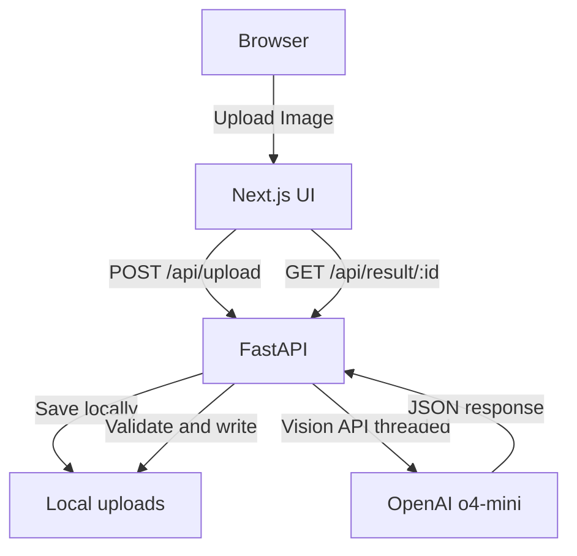

# Maritime Field Document Extraction App - Build Instructions

**For internal use, small-scale deployment (~100 documents/month)**

## Overview
A simple web application that extracts structured data from maritime field documents (images only) using OpenAI Vision API, with local file storage and Docker deployment.

## Architecture (Simplified)



## Project Structure

```
SFK2/
├── frontend/                # Next.js 14 app
│   ├── Dockerfile
│   ├── next.config.js       # Proxy rewrites to backend
│   └── ...
├── backend/                 # FastAPI service
│   ├── schema/              # JSON schema for vision parser
│   │   └── field_doc_schema.json
│   ├── Dockerfile
│   ├── main.py
│   ├── vision.py            # OpenAI Vision integration (threaded)
│   └── models.py
├── uploads/                 # Local image + JSON result storage
├── .env.example
└── docker-compose.yml
```

## 1. Backend Implementation

### `backend/main.py`

```python
from fastapi import FastAPI, UploadFile, File, HTTPException
from fastapi.responses import JSONResponse
from fastapi.middleware.cors import CORSMiddleware
from fastapi.concurrency import run_in_threadpool
from pathlib import Path
import uuid, json
from datetime import datetime
from .models import FieldDocument
from .vision import extract_document_data

app = FastAPI(title="Maritime Document Extractor")

# Allow frontend at any origin or tighten to your domain
app.add_middleware(
    CORSMiddleware,
    allow_origins=["*"],
    allow_methods=["*"],
    allow_headers=["*"],
)

UPLOAD_DIR = Path("/app/uploads")
UPLOAD_DIR.mkdir(exist_ok=True)

@app.post("/api/upload")
async def upload_document(file: UploadFile = File(...)):
    if not file.content_type.startswith("image/"):
        raise HTTPException(400, "Only image files are accepted")

    file_id = str(uuid.uuid4())
    ext = Path(file.filename).suffix
    path = UPLOAD_DIR / f"{file_id}{ext}"
    content = await file.read()
    path.write_bytes(content)

    try:
        # run blocking Vision call in threadpool
        doc: FieldDocument = await run_in_threadpool(extract_document_data, path)
        result = {
            "id": file_id,
            "status": "completed",
            "data": doc.model_dump()
        }
        (UPLOAD_DIR / f"{file_id}_result.json").write_text(
            json.dumps({
                "id": file_id,
                "filename": file.filename,
                "processed_at": datetime.utcnow().isoformat(),
                "data": doc.model_dump()
            }, indent=2)
        )
        return result

    except Exception as e:
        return {"id": file_id, "status": "error", "error": str(e)}

@app.get("/api/result/{file_id}")
async def get_result(file_id: str):
    result_path = UPLOAD_DIR / f"{file_id}_result.json"
    if not result_path.exists():
        raise HTTPException(404, "Result not found")
    return json.loads(result_path.read_text())

@app.get("/health")
async def health_check():
    return {"status": "healthy"}
```

### `backend/vision.py`

```python
import openai, json, base64, os
from pathlib import Path
from .models import FieldDocument
from pydantic import ValidationError

client = openai.OpenAI(api_key=os.getenv("OPENAI_API_KEY"))

async def extract_document_data(image_path: Path, max_retries: int = 3) -> FieldDocument:
    # load strict JSON schema
    schema = json.loads((Path(__file__).parent / "schema/field_doc_schema.json").read_text())
    schema["additionalProperties"] = False

    image_b64 = base64.b64encode(image_path.read_bytes()).decode()
    system_prompt = """
You are a maritime cargo document parser. Extract ALL values exactly per schema:
1. Tank IDs, dates in ISO-8601, all tank rows,
2. calculate summary totals,
3. preserve decimals, etc.
"""
    messages = [
      {"role": "system", "content": system_prompt},
      {"role": "user", "content": [
         {"type": "text", "text": "Extract all data from this document, incl. vessel name, tanks, timestamps."},
         {"type": "image_url", "image_url": {"url": f"data:image/jpeg;base64,{image_b64}"}}
      ]}
    ]

    for attempt in range(max_retries):
        try:
            response = client.chat.completions.create(
                model="o4-mini",
                messages=messages,
                temperature=0,
                response_format={
                  "type": "json_schema",
                  "json_schema": {"name": "field_document_extraction", "strict": True, "schema": schema}
                }
            )
            extracted = response.choices[0].message.content
            return FieldDocument.model_validate_json(extracted)
        except Exception as e:
            if attempt < max_retries - 1:
                # add context and retry
                messages.append({"role": "assistant", "content": extracted if 'extracted' in locals() else ""})
                messages.append({"role": "user", "content": f"Please fix error and capture all data: {e}"})
            else:
                raise
```

### `backend/models.py`

```python
from pydantic import BaseModel, Field, ConfigDict
from typing import Dict, List, Optional
from datetime import datetime

class TankCondition(BaseModel):
    tank_id: str
    product: str
    api: float
    ullage_ft: float
    ullage_in: float
    temperature_f: float
    water_bbls: float = 0.0
    gross_bbls: float
    net_bbls: float = Field(default=None)  # Make optional as it's calculated
    metric_tons: float = Field(default=None)  # Make optional as it's calculated
    
    model_config = ConfigDict(extra='forbid')  # Strict validation

class ProductTotals(BaseModel):
    gross_bbls: float
    net_bbls: float = Field(default=None)
    metric_tons: float = Field(default=None)
    
    model_config = ConfigDict(extra='forbid')

class Timestamps(BaseModel):
    arrival: Optional[datetime] = None
    all_fast: Optional[datetime] = None
    boom_on: Optional[datetime] = None
    hose_on: Optional[datetime] = None
    comm_ld: Optional[datetime] = None
    comp_ld: Optional[datetime] = None
    hose_off: Optional[datetime] = None
    boom_off: Optional[datetime] = None
    depart: Optional[datetime] = None
    
    model_config = ConfigDict(extra='forbid')

class Drafts(BaseModel):
    fwd_port: float
    fwd_stbd: float
    aft_port: float
    aft_stbd: float
    
    model_config = ConfigDict(extra='forbid')

class BargeInfo(BaseModel):
    name: str
    voyage_number: Optional[str] = None
    otb_job_number: Optional[str] = None
    
    model_config = ConfigDict(extra='forbid')

class PortInfo(BaseModel):
    vessel_name: str
    port_city: Optional[str] = None
    
    model_config = ConfigDict(extra='forbid')

class ArrivalDeparture(BaseModel):
    water_specific_gravity: Optional[float] = None
    drafts_ft: Optional[Drafts] = None
    timestamps: Optional[Timestamps] = None
    tanks: List[TankCondition]
    summary_by_product: Optional[Dict[str, ProductTotals]] = None
    
    model_config = ConfigDict(extra='forbid')

class FieldDocument(BaseModel):
    barge: BargeInfo
    port: PortInfo
    arrival: ArrivalDeparture
    departure: ArrivalDeparture
    products_loaded_discharged: Optional[Dict[str, ProductTotals]] = None
    
    model_config = ConfigDict(extra='forbid')
```

## 2. Simplified Docker Setup

### `backend/Dockerfile`

```dockerfile
FROM python:3.12-slim

WORKDIR /app

# install deps
COPY requirements.txt .
RUN pip install --no-cache-dir -r requirements.txt

# copy code + schema
COPY . .

# ensure upload dir exists
RUN mkdir -p uploads

EXPOSE 8000
CMD ["uvicorn", "main:app", "--host", "0.0.0.0", "--port", "8000"]
```

### `docker-compose.yml`

```yaml
version: "3.9"

services:
  backend:
    build: ./backend
    ports:
      - "8000:8000"
    volumes:
      - ./uploads:/app/uploads
    environment:
      - OPENAI_API_KEY=${OPENAI_API_KEY}
    restart: unless-stopped
    healthcheck:
      test: ["CMD", "curl", "-f", "http://localhost:8000/health"]
      interval: 30s
      timeout: 5s
      retries: 3

  frontend:
    build: ./frontend
    ports:
      - "3000:3000"
    environment:
      - NEXT_PUBLIC_API_URL=${NEXT_PUBLIC_API_URL:-http://localhost:8000}
    depends_on:
      backend:
        condition: service_healthy
    restart: unless-stopped
```

## 3. Deployment Instructions

### Initial VPS Setup (Ubuntu/Debian)

```bash
# Install Docker
curl -fsSL https://get.docker.com | sh
sudo usermod -aG docker $USER

# Clone repository
git clone https://github.com/sherafyk/.git
cd 

# Create .env file
cp .env.example .env
# Edit .env and add your OPENAI_API_KEY

# Create directories
mkdir -p uploads data

# Build and run
docker compose up -d
```

### Simple Update Process

```bash
cd SFK2
git pull
docker compose down
docker compose up -d --build
```

## 4. Frontend (Simplified)

Create an elegant modern style Next.js app with:
- Single upload page with drag-and-drop (and file picker)
- Progress indicator during OCR call
- Result display on success, with JSON download button
- Error alerts if parsing fails with specific details on error.

### frontend/next.config.js

```js
/** @type {import('next').NextConfig} */
const nextConfig = {
  async rewrites() {
    return [
      {
        source: '/api/:path*',
        destination: process.env.NEXT_PUBLIC_API_URL
          ? `${process.env.NEXT_PUBLIC_API_URL}/api/:path*`
          : 'http://localhost:8000/api/:path*',
      },
    ]
  }
}
module.exports = nextConfig;
```

